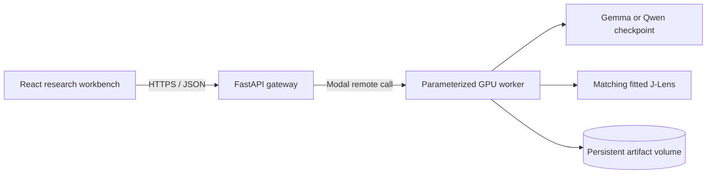

# Open Silico

Open Silico is an open-source interpretability workbench for observing and causally intervening on the internal representations of open-weight language models.

It combines a browser-based research interface, a typed FastAPI gateway, and parameterized Modal GPU workers. Model weights and fitted lens artifacts stay on remote infrastructure; local development does not download model checkpoints.

## What works today

| Capability | Gemma 3 1B Instruct | Qwen3 1.7B |
| --- | --- | --- |
| Model switcher | Yes | Yes |
| Jacobian Lens | Yes | Yes |
| Contrastive activation steering | Yes | Yes |
| Remote Modal execution | Yes | Yes |

### Linked Jacobian Lens

The J-Lens instrument is based on the interaction model in Anthropic's Jacobian Lens research interface. It provides:

- a layer-by-position argmax matrix;
- linked by-layer and by-position token readouts;
- token pinning with exact full-vocabulary ranks;
- a logarithmic rank heatmap;
- synchronized rank trajectories across layers and positions; and
- pinned model, lens, and implementation revisions for reproducibility.

J-Lens readouts are approximate learned transports into the final-layer basis. They should not be interpreted as literal model thoughts.

### Activation steering

The steering workbench derives a contrast direction from user-supplied examples:

```text
direction = mean(positive activations) - mean(negative activations)
```

It then runs baseline and steered generations with matched sampling settings and seed. The intervention is applied through a temporary residual-stream hook and removed in an exception-safe scope after every request. A behavioral change demonstrates causal influence at the selected layer; it does not prove that the direction has one monosemantic human interpretation.

## Architecture



- `frontend/` — React, TypeScript, Vite, and the technique-specific interfaces.
- `backend/open_silico/` — request contracts, model registry, API, and remote runners.
- `backend/modal_app.py` — pinned GPU image, model lifecycle, J-Lens computation, and activation hooks.
- `tests/backend/` — fast contract and API tests.
- `tests/remote/` — opt-in tests against deployed GPU infrastructure.
- `docs/PRD.md` — MVP product requirements and longer-term roadmap.

## Models and artifacts

| Key | Checkpoint | Access |
| --- | --- | --- |
| `gemma-3-1b-it` | `google/gemma-3-1b-it` | Gated; requires accepting the Gemma license and supplying a Hugging Face token |
| `qwen3-1.7b` | `Qwen/Qwen3-1.7B` | Public, Apache-2.0 |

Every checkpoint, fitted Neuronpedia lens, and Anthropic Jacobian Lens dependency is pinned to an immutable revision in the source. See `backend/modal_app.py` and `backend/open_silico/model_registry.py` for the exact artifact identities.

## Local development

Prerequisites:

- Python 3.12 or newer;
- [`uv`](https://docs.astral.sh/uv/);
- Node.js 22 or newer; and
- a configured [Modal](https://modal.com/) account for real model execution.

Install dependencies and create local configuration:

```bash
uv sync
cp backend/.env.example backend/.env
cp frontend/.env.example frontend/.env
cd frontend && npm ci
```

Start the local API from the repository root:

```bash
PYTHONPATH=backend uv run uvicorn open_silico.api:app --reload
```

Start the frontend in a second terminal:

```bash
cd frontend
npm run dev
```

Open `http://localhost:5173`. Local API documentation is available at `http://localhost:8000/docs`.

The local `.env` files are ignored by Git. Only non-sensitive examples are committed.

## Modal deployment

Gemma requires a Modal Secret containing `HF_TOKEN`. The default secret name is `huggingface-secret`; create it through the Modal dashboard or CLI after accepting the model license on Hugging Face.

Deploy the API and parameterized L40S worker:

```bash
OPEN_SILICO_HF_SECRET_NAME=huggingface-secret \
  uv run modal deploy backend/modal_app.py
```

To use the deployed API from the local Vite application, configure `frontend/.env`:

```dotenv
VITE_API_BASE_URL=
VITE_API_PROXY_TARGET=https://your-workspace--open-silico-jlens-api.modal.run
```

## API

| Method | Path | Purpose |
| --- | --- | --- |
| `GET` | `/health` | API and catalog status without waking a GPU |
| `GET` | `/api/models` | Model access and technique capability catalog |
| `POST` | `/api/jlens/run` | Compute a bounded linked Jacobian Lens slice |
| `POST` | `/api/steer` | Run a matched baseline/steered generation experiment |

Interactive OpenAPI documentation is served at `/docs`.

## Verification

Run the local suite:

```bash
uv run ruff check backend tests
uv run ruff format --check backend tests
uv run pytest

cd frontend
npm test
npm run lint
npm run build
```

After deploying Modal, run the opt-in tests for both model/lens pairs and their strength-zero steering controls:

```bash
OPEN_SILICO_RUN_MODAL_SMOKE=1 \
  uv run pytest tests/remote/test_modal_jlens.py
```

Remote tests consume GPU resources and are skipped by default.

## Security and data handling

- Provider credentials belong in Modal Secrets, never browser code or repository files.
- Prompts are sent to the configured Modal deployment for inference.
- The current API does not implement persistent experiment storage.
- Request sizes and generation lengths are bounded at the API boundary.
- One model worker handles one stateful intervention at a time so temporary hooks cannot overlap.

## Roadmap

The next slices cover multi-turn paired steering, richer presets and generation controls, reproducible experiment sharing, model-adapter expansion, natural-language autoencoders, circuit tools, and additional open interpretability methods. The tracked work is available in [GitHub Issues](https://github.com/perfect7613/open-silico/issues).

## License

Open Silico is licensed under the [Apache License 2.0](LICENSE). Model weights, fitted lenses, and third-party libraries retain their respective licenses and terms.
