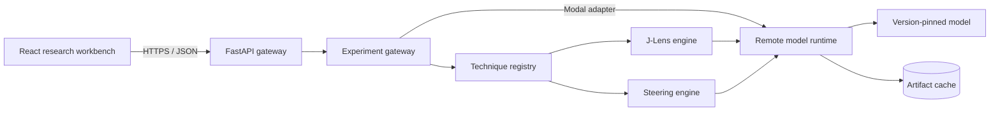

# Mechanoscope

Mechanoscope is an open-source laboratory for observing, intervening on, and debugging the internal representations of open-weight language models.

It combines a browser-based research interface, a typed FastAPI gateway, pluggable technique engines, and parameterized Modal GPU workers. Model weights and fitted artifacts stay on remote infrastructure; local development does not download model checkpoints.

## What works today

| Capability | Gemma 3 1B Instruct | Qwen3 1.7B |
| --- | --- | --- |
| Model switcher | Yes | Yes |
| Jacobian Lens | Yes | Yes |
| Contrastive activation steering | Yes | Yes |
| Remote Modal execution | Yes | Yes |
| Browser-local experiment history and JSON export | Yes | Yes |
| Cross-technique Causal Trace and X-Ray card | Yes | Yes |

## Why Mechanoscope

Interpretability platforms usually make one of two things excellent: a large atlas of internal features or an environment for expert model-development teams. Mechanoscope is building the missing open workflow between the instruments: a falsifiable, reproducible causal debugging loop.

| Existing approach | What users already get | Mechanoscope's distinct focus |
| --- | --- | --- |
| Public interpretability atlases | Large hosted datasets, feature search, steering, circuits, model readouts, APIs, and community releases | Join observations and interventions into one replayable evidence chain instead of treating each technique result as the endpoint |
| Closed model-design environments | Agent-planned experiments, diagnostics, intervention, team workflows, and managed infrastructure | Make the experiment protocol open, inspectable, self-hostable, and explicit about the boundary between influence and mechanism |
| Research repositories and notebooks | Fast access to new techniques and reference implementations | Turn techniques into typed adapters inside a consistent debugging and evidence workflow |
| **Mechanoscope** | An open model observatory with remote execution and typed technique adapters | Hypothesis → observation → matched intervention → limitation-aware causal receipt → replay/share |

### The first moat: Causal Trace

Causal Trace pairs a Jacobian Lens observation with an activation-steering intervention on the same pinned model. It produces an evidence ladder, preserves both experiment IDs, identifies whether the matched outputs diverged, and keeps “mechanism established” unresolved until stronger controls exist. The result exports as JSON for reproduction and as a shareable SVG X-Ray card.

This is intentionally stronger than another attractive dashboard: each new interpretability technique can become an Observation, Intervention, or Evaluation adapter in the same protocol. The durable goal is an open corpus of forkable causal traces and evaluation recipes.

### Linked Jacobian Lens

The J-Lens instrument is based on the interaction model in Anthropic's Jacobian Lens research interface. It provides:

- a layer-by-position argmax matrix;
- linked by-layer and by-position token readouts;
- token pinning with exact full-vocabulary ranks;
- a logarithmic rank heatmap;
- synchronized rank trajectories across layers and positions;
- a lazy-loaded React Three Fiber representation volume with synchronized 2D, 3D, and split views; and
- pinned model, lens, and implementation revisions for reproducibility.

J-Lens readouts are approximate learned transports into the final-layer basis. They should not be interpreted as literal model thoughts.

### Activation steering

The steering workbench derives a contrast direction from user-supplied examples:

```text
direction = mean(positive activations) - mean(negative activations)
```

It then runs baseline and steered generations with matched sampling settings and seed. The intervention is applied through a temporary residual-stream hook and removed in an exception-safe scope after every request. A behavioral change demonstrates causal influence at the selected layer; it does not prove that the direction has one monosemantic human interpretation.

## Architecture



- `frontend/` — React, TypeScript, Vite, React Three Fiber, and the technique-specific interfaces.
- `backend/open_silico/model_specs.py` — dependency-light, authoritative model facts used by local and GPU runtimes.
- `backend/open_silico/technique_registry.py` — authoritative capability metadata and the extension point for future techniques.
- `backend/open_silico/remote_runtime.py` — model loading, activation capture, intervention, and generation independent of Modal.
- `backend/open_silico/techniques/` — scientific technique engines behind typed contracts.
- `backend/modal_app.py` — the Modal deployment adapter and GPU image boundary.
- `tests/backend/` — fast contract and API tests.
- `tests/remote/` — opt-in tests against deployed GPU infrastructure.
- `docs/PRD.md` — MVP product requirements and longer-term roadmap.

## Models and artifacts

| Key | Checkpoint | Access |
| --- | --- | --- |
| `gemma-3-1b-it` | `google/gemma-3-1b-it` | Gated; requires accepting the Gemma license and supplying a Hugging Face token |
| `qwen3-1.7b` | `Qwen/Qwen3-1.7B` | Public, Apache-2.0 |

Every checkpoint, fitted lens, and Jacobian Lens dependency is pinned to an immutable revision in the source. See `backend/modal_app.py` and `backend/open_silico/model_specs.py` for the exact artifact identities.

## Local development

Prerequisites:

- Python 3.12 or newer;
- [`uv`](https://docs.astral.sh/uv/);
- Node.js 22 or newer; and
- a configured [Modal](https://modal.com/) account for real model execution.

Install dependencies and create local configuration:

```bash
uv sync
cp backend/.env.example backend/.env
cp frontend/.env.example frontend/.env
cd frontend && npm ci
```

Start the local API from the repository root:

```bash
PYTHONPATH=backend uv run uvicorn open_silico.api:app --reload
```

Start the frontend in a second terminal:

```bash
cd frontend
npm run dev
```

Open `http://localhost:5173`. Local API documentation is available at `http://localhost:8000/docs`.

The local `.env` files are ignored by Git. Only non-sensitive examples are committed.

## Modal deployment

Gemma requires a Modal Secret containing `HF_TOKEN`. The default secret name is `huggingface-secret`; create it through the Modal dashboard or CLI after accepting the model license on Hugging Face.

Deploy the API and parameterized L40S worker:

```bash
MECHANOSCOPE_HF_SECRET_NAME=huggingface-secret \
  uv run modal deploy backend/modal_app.py
```

The current public demo is [ameymuke252003--mechanoscope-api.modal.run](https://ameymuke252003--mechanoscope-api.modal.run). The web application scales to zero; a GPU worker wakes only when an experiment is submitted.

To use the deployed API from the local Vite application, configure `frontend/.env`:

```dotenv
VITE_API_BASE_URL=
VITE_API_PROXY_TARGET=https://your-workspace--mechanoscope-api.modal.run
```

## API

| Method | Path | Purpose |
| --- | --- | --- |
| `GET` | `/health` | API and catalog status without waking a GPU |
| `GET` | `/api/models` | Model access and technique capability catalog |
| `GET` | `/api/techniques` | Platform technique metadata and execution capabilities |
| `POST` | `/api/experiments/run` | Run a typed technique request and return a replayable provenance envelope |
| `POST` | `/api/jlens/run` | Compute a bounded linked Jacobian Lens slice |
| `POST` | `/api/steer` | Run a matched baseline/steered generation experiment |

Interactive OpenAPI documentation is served at `/docs`.

## Verification

Run the local suite:

```bash
uv run ruff check backend tests
uv run ruff format --check backend tests
uv run pytest

cd frontend
npm test
npm run lint
npm run build
```

After deploying Modal, run the opt-in tests for both model/lens pairs and their strength-zero steering controls:

```bash
MECHANOSCOPE_RUN_MODAL_SMOKE=1 \
  uv run pytest tests/remote/test_modal_jlens.py
```

Remote tests consume GPU resources and are skipped by default.

### Credentials

| Credential | Required for | Status |
| --- | --- | --- |
| Modal CLI authentication | Real model execution | Already configured locally |
| Modal Secret containing `HF_TOKEN` | Gated Gemma checkpoint | Configure the secret named by `MECHANOSCOPE_HF_SECRET_NAME` |

Never commit these values. Secrets should be injected through provider secret stores or the local shell.

## Security and data handling

- Provider credentials belong in Modal Secrets, never browser code or repository files.
- Prompts are sent to the configured Modal deployment for inference.
- The current API does not implement persistent experiment storage.
- Request sizes and generation lengths are bounded at the API boundary.
- One model worker handles one stateful intervention at a time so temporary hooks cannot overlap.

## Roadmap

Phase 1 builds a trustworthy experiment loop through steering controls, multi-turn comparisons, evidence sweeps, reproducible local records, and compute safety. Phase 2 turns the two-model application into a capability-aware platform with authoritative model and technique registries, Hugging Face onboarding, runtime adapters, and artifact compatibility checks. The implementation sequence and exit criteria are documented in [`docs/PRD.md`](docs/PRD.md); tracked work remains in the repository's existing [GitHub Issues](https://github.com/perfect7613/open-silico/issues).

## License

Mechanoscope is licensed under the [Apache License 2.0](LICENSE). Model weights, fitted lenses, and third-party libraries retain their respective licenses and terms.
