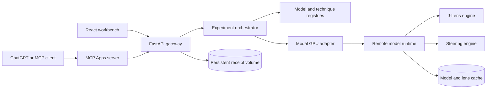

# Mechanoscope

Mechanoscope is an open-source observatory for inspecting and intervening on open-weight language models. It turns interpretability techniques into reproducible experiments with pinned model revisions, matched controls, durable receipts, replay, forking, and explicit limits on what the evidence supports.

Model weights run on on-demand Modal GPUs and are never downloaded to the browser or local development machine.

## Live demo

- **Web application:** [ameymuke252003--mechanoscope-api.modal.run](https://ameymuke252003--mechanoscope-api.modal.run)
- **Remote MCP endpoint:** `https://ameymuke252003--mechanoscope-mcp.modal.run/mcp`
- **Source:** [github.com/perfect7613/open-silico](https://github.com/perfect7613/open-silico)

For a short evaluation with no new GPU spend:

1. Open **Research copilot** and read the five-stage protocol.
2. Select **Inspect J-Lens receipt** or **Inspect steering receipt** to load the corresponding persisted GPU result directly.
3. Open the Jacobian Lens receipt to inspect its layer-by-position readout.
4. Compare the matched steering receipt, including the intervention that did not produce the intended concept.
5. Open **Check a claim**. Mechanoscope verifies the shared model and exact prompt, then blocks a causal-mechanism claim because the steering vector was not derived from the selected J-Lens representation.

The unsuccessful intervention is deliberately retained. A research tool should expose negative evidence instead of turning every run into a success story.

### ChatGPT research copilot

Connect the remote MCP endpoint to ChatGPT, select GPT-5.6, and state a falsifiable hypothesis. No separate OpenAI API key is required for this path. The copilot follows a guarded workflow:

```text
hypothesis → digest-pinned paired plan → explicit GPU approval
           → J-Lens receipt + steering receipt → supported/unsupported conclusions
```

The approved plan cannot be silently changed before execution. ChatGPT receives both durable receipts and a structured evidence report, including failed comparability checks and conclusions the experiment does not support.

The website's copilot screen is a transparent handoff, not a simulated agent: GPT-5.6 creates the plan by calling `plan_research_study`, execution is refused until the user approves its exact digest, and `inspect_research_study` produces the final evidence boundary.

### OpenAI Build Week implementation

- **GPT-5.6** is the reasoning layer in ChatGPT: it converts a research hypothesis into the typed MCP study plan, presents the approval checkpoint, and explains the returned evidence report.
- **Codex** accelerated the product implementation across the typed experiment architecture, Modal runtime separation, generated API contracts, MCP tools, React workbenches, scientific guardrails, automated tests, and live deployment.
- **Key product decision:** the language model never receives authority to silently spend GPU compute. Planning is read-only; execution requires an explicit approval tied to the unchanged plan digest.
- **Key scientific decision:** observation and intervention receipts remain separate unless representation lineage is established. Matching a model and prompt does not manufacture a causal link.

For the submission video, show this exact path in under three minutes: state the hypothesis in GPT-5.6, inspect the proposed plan, approve it, open both receipts, and end on the unsupported-conclusions block. The Devpost submission also requires the Codex `/feedback` session ID; it is intentionally not stored in this repository.

## What is implemented

| Capability | Status |
| --- | --- |
| Gemma 3 1B and Qwen3 1.7B model switcher | Available |
| Interactive Jacobian Lens | Available |
| Contrastive activation steering | Available |
| Linked 2D and React Three Fiber views | Available |
| Matched baseline and intervention generation | Available |
| Persistent experiment receipts | Available |
| Replay, fork, compare, and JSON export | Available |
| Claim compatibility guard | Available |
| Remote MCP tools and embedded result widget | Available |
| Digest-pinned ChatGPT research copilot | Available |
| On-demand Modal GPU execution | Available |

## Why it is different

Mechanoscope treats an interpretability result as evidence inside an experiment, not as a self-explanatory picture.

The platform has three technique roles:

- **Observation** instruments expose internal structure, such as Jacobian Lens readouts.
- **Intervention** instruments change a controlled internal signal, such as activation steering.
- **Evaluation** instruments determine whether two receipts are comparable and what conclusions remain unsupported.

The current Claim Check is intentionally conservative. Matching a model and prompt is useful parallel evidence, but it is not a causal chain unless the intervention is derived from the observed representation and evaluated with appropriate controls.

## Instruments

### Jacobian Lens

The workbench presents a bounded layer-by-position slice with:

- token-level input positions and predictions;
- linked by-layer and by-position readouts;
- full-vocabulary rank tracking for pinned tokens;
- synchronized rank heatmaps and trajectories;
- 2D, 3D, and split representation views; and
- pinned checkpoint, fitted-lens, and implementation revisions.

Jacobian Lens is a learned approximation into the final-layer basis. Its token readouts are not literal model thoughts.

### Activation steering

The steering engine constructs a contrast direction:

```text
direction = mean(positive-example activations) - mean(negative-example activations)
```

It generates a baseline and intervention branch with matched sampling parameters and seed. A residual-stream hook is installed only for the scoped intervention and removed safely afterward. A changed output demonstrates influence for that run; it does not establish that the direction is monosemantic.

## Architecture



- `frontend/` contains the React, TypeScript, and React Three Fiber workbench.
- `backend/open_silico/` contains contracts, registries, experiment orchestration, persistence, and technique modules.
- `backend/modal_app.py` contains only Modal deployment adapters and remote lifecycle wiring.
- `mcp-server/` contains the streamable HTTP MCP server and embedded Apps SDK result widget.
- `scripts/` contains reproducible deployment and local MCP entry points.

## Self-deploy on Modal

Prerequisites:

- Python 3.12 or newer;
- [`uv`](https://docs.astral.sh/uv/);
- Node.js 20 or newer; and
- an authenticated [Modal](https://modal.com/) CLI profile.

Clone and deploy:

```bash
git clone https://github.com/perfect7613/open-silico.git
cd open-silico
uv sync
./scripts/deploy-modal.sh
```

This deploys the web application, persistent receipt volume, MCP endpoint, and an L40S model worker. The public Qwen model requires no Hugging Face credential.

Gemma is gated. After accepting its license, create a Modal Secret containing `HF_TOKEN` and pass its name during deployment:

```bash
uv run modal secret create huggingface-secret HF_TOKEN=hf_your_token
MECHANOSCOPE_HF_SECRET_NAME=huggingface-secret ./scripts/deploy-modal.sh
```

Do not place a Hugging Face token in an `.env` file committed to Git.

If the Modal profile name differs from the workspace URL slug, provide the API URL explicitly:

```bash
MECHANOSCOPE_DEPLOYED_API_URL=https://your-workspace--mechanoscope-api.modal.run \
  ./scripts/deploy-modal.sh
```

The deployment remains addressable until stopped. Web containers scale down while idle, and the GPU worker scales down five minutes after its last experiment.

## Run the MCP server yourself

The MCP server can target either a local API or a deployed Mechanoscope API.

```bash
MECHANOSCOPE_API_URL=https://your-workspace--mechanoscope-api.modal.run \
MECHANOSCOPE_APP_URL=https://your-workspace--mechanoscope-api.modal.run \
  ./scripts/run-mcp-local.sh
```

The streamable HTTP endpoint is then available at `http://127.0.0.1:8787/mcp`.

For a remote deployment, `./scripts/deploy-modal.sh` packages the same server at:

```text
https://your-workspace--mechanoscope-mcp.modal.run/mcp
```

Add that HTTPS endpoint to an MCP-compatible client. In ChatGPT Developer Mode, the server exposes model discovery, experiment planning, receipt lookup, execution, replay, and fork tools. GPU-changing tools require an explicit approval field; read-only discovery does not wake a GPU.

The MCP surface supports ChatGPT Developer Mode and other streamable-HTTP MCP clients. The browser workbench is tested on current Chrome for macOS and is designed for modern Chromium, Safari, and Firefox browsers. WebGL is required for the 3D layer view; the 2D instrument remains available without it.

Persisted sample data is available without rebuilding or running a GPU:

- [Jacobian Lens sample receipt](https://ameymuke252003--mechanoscope-api.modal.run/?experiment=bea87f1c-af24-48ea-af65-1f0030759a03)
- [Activation steering sample receipt](https://ameymuke252003--mechanoscope-api.modal.run/?experiment=c4cf5bad-36d4-457b-8702-2f2624b102ea)

A useful first prompt is:

```text
Test the hypothesis that a cat-related residual direction changes how Qwen describes
a household pet. Plan the controlled study first, show me the exact requests and
limitations, and do not use GPU compute until I approve the unchanged plan.
```

## Local development

Install dependencies and create non-secret local configuration:

```bash
uv sync
cp backend/.env.example backend/.env
cp frontend/.env.example frontend/.env
npm --prefix frontend ci
npm --prefix mcp-server ci
```

Run the API:

```bash
PYTHONPATH=backend uv run uvicorn open_silico.api:app --reload
```

Run the browser application in another terminal:

```bash
npm --prefix frontend run dev
```

Open `http://localhost:5173`. FastAPI documentation is available at `http://localhost:8000/docs`.

## API and MCP surface

Important API routes:

| Method | Path | Purpose |
| --- | --- | --- |
| `GET` | `/health` | Check API state without waking a GPU |
| `GET` | `/api/models` | List models, access state, and capabilities |
| `GET` | `/api/techniques` | List technique metadata |
| `GET` | `/api/experiments` | List durable experiment receipts |
| `POST` | `/api/experiments/run` | Execute a typed experiment |
| `POST` | `/api/experiments/{id}/replay` | Repeat an exact recorded request |
| `POST` | `/api/experiments/{id}/fork` | Run an explicitly modified child request |

The MCP server exposes equivalent discovery and experiment operations. Execution, replay, and fork requests must carry explicit approval before remote GPU work begins.

## Verification

```bash
uv run ruff check backend tests
uv run ruff format --check backend tests
uv run pytest

npm --prefix frontend test -- --run
npm --prefix frontend run build

npm --prefix mcp-server test -- --run
npm --prefix mcp-server run build
```

Remote smoke tests are opt-in because they consume GPU resources:

```bash
MECHANOSCOPE_RUN_MODAL_SMOKE=1 uv run pytest tests/remote/test_modal_jlens.py
```

## Security and data handling

- Provider credentials are read from Modal Secrets, never sent to the browser or MCP client.
- Prompts and technique inputs are sent to the configured deployment and retained in experiment receipts.
- Public receipt deletion is disabled unless an owner bearer token is configured.
- Prompt length, generation length, and MCP execution approval are validated at system boundaries.
- One stateful intervention runs per model worker so temporary activation hooks cannot overlap.

Do not use the public demo for confidential prompts.

## Stop a deployment

```bash
uv run modal app stop mechanoscope
```

Stopping the app terminates its containers but does not delete persistent volumes. To permanently remove saved receipts:

```bash
uv run modal volume delete mechanoscope-experiments
```

Volume deletion is destructive.

## License

Mechanoscope is licensed under the [Apache License 2.0](LICENSE). Model weights, fitted lenses, and third-party packages retain their own licenses and usage terms.
